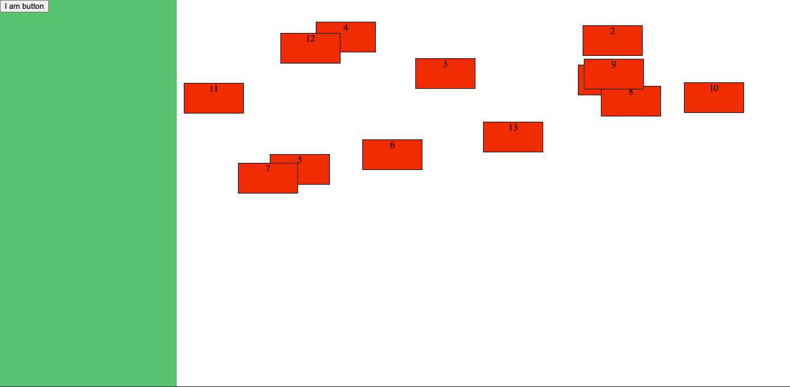

# Drag and Drop form builder

## Version One:

### Initial Version
- Implementing drag items inside the dropzone using mouse elements
- Tried drag and drop API
- Base version of the concept

Here is the [Demo link ](https://laughing-edison-270381.netlify.app/)

## References
[Draggable Ref](https://glitch.com/edit/#!/frosted-deeply-tango?path=script.js%3A47%3A2) \
[Moving div around, Ref](https://www.tnado.com/blog/javascript-move-div-with-the-mouse/?cookie=accept) \
[About cordinates](https://javascript.info/size-and-scroll#geometry)
[Form Builder Ref](https://formbuilder.online/)

## DND 
[Basics](https://www.html5rocks.com/en/tutorials/dnd/basics/)
[Example 1](https://codepen.io/tieppt/pen/GZPVjx?editors=1010)
[Example 2](https://codepen.io/Mayar-Shah/pen/pBMXOV)

## React DND 
[Example 1](https://blog.logrocket.com/create-a-drag-and-drop-component-with-react-dropzone/)
[Example 2](https://codepen.io/hussard/pen/XWWjybb?editors=1010)
[Example 3](https://codepen.io/marklc44/pen/qNqoBZ?editors=0010)
